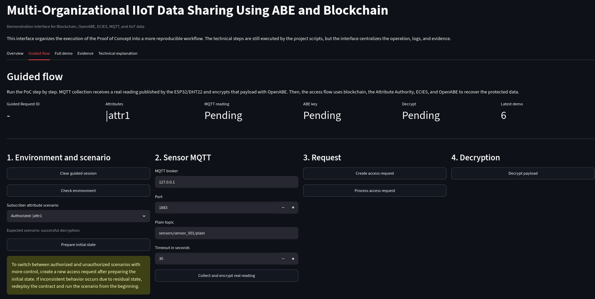
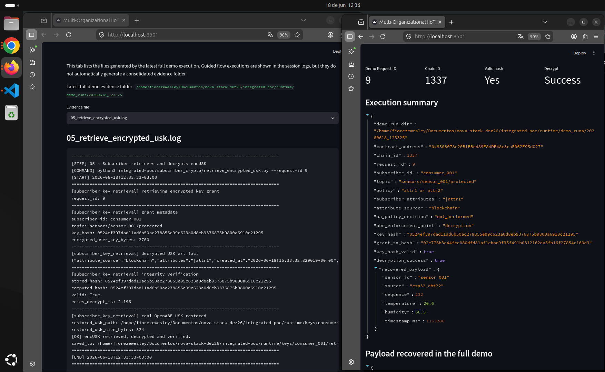

# Multi-Organizational IIoT Data Sharing Using ABE and Blockchain

## Overview

This website presents the technical documentation of a prototype master's thesis focused on data interoperability, privacy, and access governance in Industrial Internet of Things (IIoT) environments.

The proposed architecture integrates off-chain MQTT-based communication, Attribute-Based Encryption (ABE), ECIES-based key protection, an off-chain Attribute Authority, and on-chain governance records using Hyperledger Besu.

Sensitive sensor data and ABE cryptographic operations remain off-chain. The blockchain layer is used to register devices, attributes, topic policies, access requests, encrypted key grants, integrity hashes, and audit events.

## Current Implementation

At the current stage, the repository includes an integrated proof of concept that validates the interaction among:

* MQTT-based sensor data collection;
* CP-ABE payload protection using OpenABE;
* Hyperledger Besu blockchain records;
* the `AccessPolicyRegistryV3` smart contract;
* an off-chain Attribute Authority;
* ECIES-protected delivery of OpenABE User Secret Keys;
* subscriber-side key retrieval and integrity verification;
* successful and unsuccessful decryption scenarios according to ABE access policies.

## Architecture Layers

The system is structured into two main layers:

* **Off-chain operational layer:** IIoT sensors, MQTT broker, producer-side and subscriber-side cryptographic frameworks, OpenABE, ECIES utilities, and the Attribute Authority.
* **On-chain governance layer:** Hyperledger Besu and the `AccessPolicyRegistryV3` smart contract for auditable access-related metadata.

The blockchain does not store plaintext sensor data and does not execute ABE cryptographic operations. Its role is to coordinate and audit governance records associated with access control and key provisioning.

## Demonstration Interface

A Streamlit-based interface was developed to support guided execution and inspection of the integrated proof of concept. The interface centralizes the main validation steps, including environment verification, initial on-chain state preparation, MQTT sensor data collection, access request creation, Attribute Authority processing, encrypted key retrieval, integrity verification, and CP-ABE decryption.

**Figure:** Streamlit guided flow for executing the integrated proof of concept.

The interface also provides access to runtime evidence, logs, execution summaries, hash verification results, decryption status, and recovered payloads. This supports reproducibility and makes it easier to inspect both authorized and unauthorized access scenarios.

**Figure:** Evidence view showing key retrieval logs, integrity verification, decryption status, and recovered payload.

## Navigation

* [System Architecture](architecture.md)
* [Experimental Environment](experimental-environment.md)
* [Experimental Results](results.md)
* [Tests](tests.md)
* [Source Code](code.md)

## Contribution

This prototype demonstrates the feasibility of combining MQTT-based IIoT communication, CP-ABE data-centric protection, ECIES-protected key delivery, and blockchain-supported governance for secure cross-organizational data sharing.

The repository also includes ABE experiments that evaluate cryptographic correctness, processing overhead, ciphertext expansion, protected payload size, policy complexity, and accumulated overhead using real ESP32/DHT22 sensor measurements.
